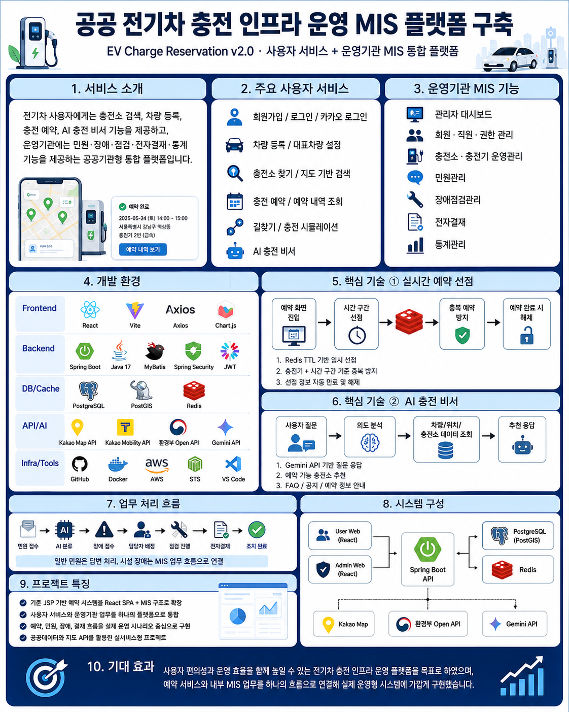
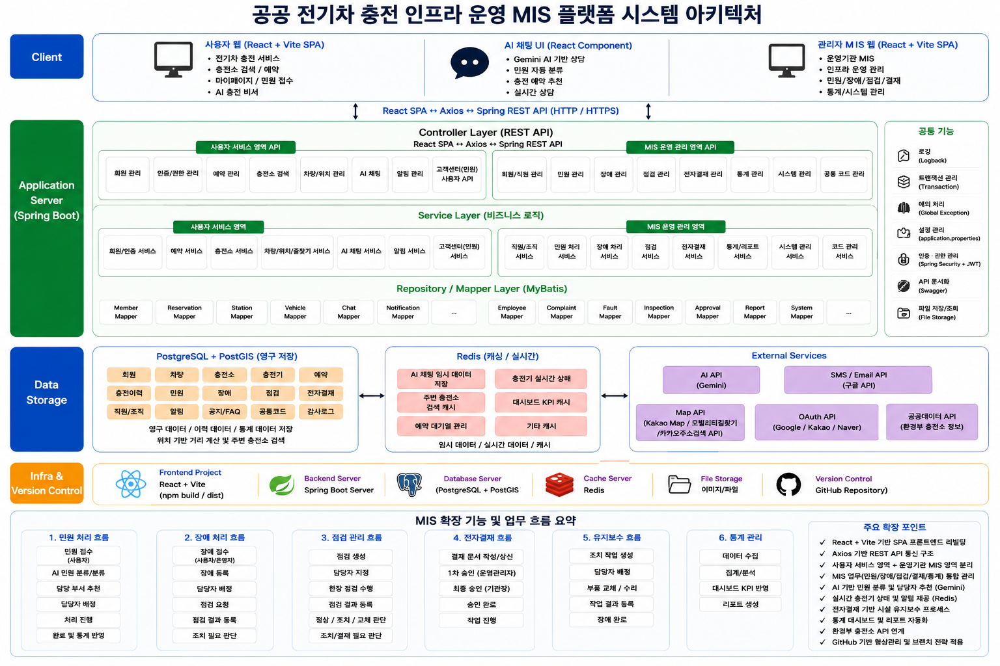
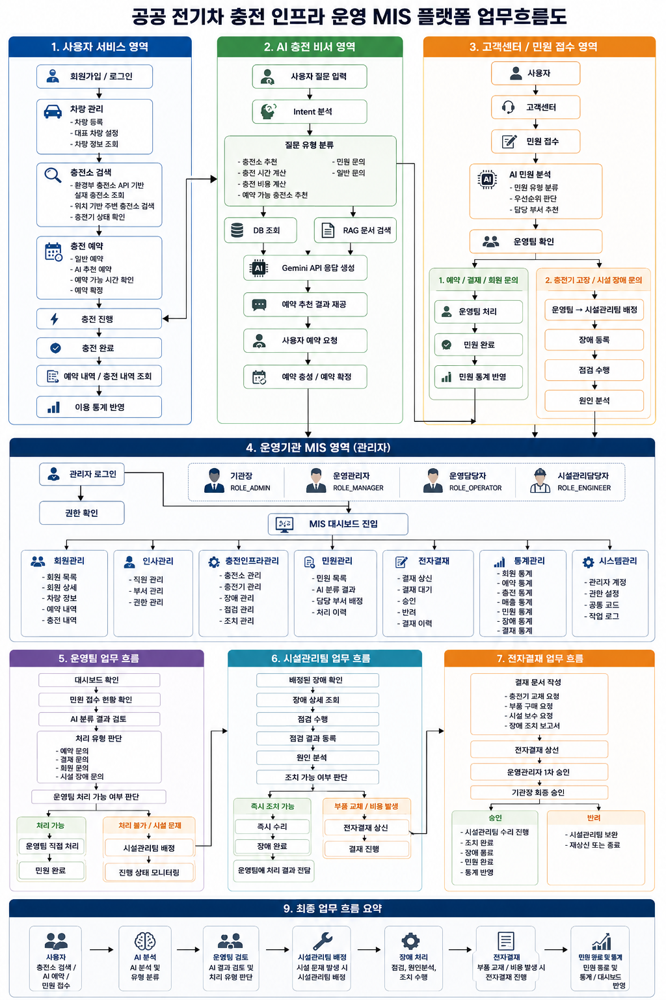
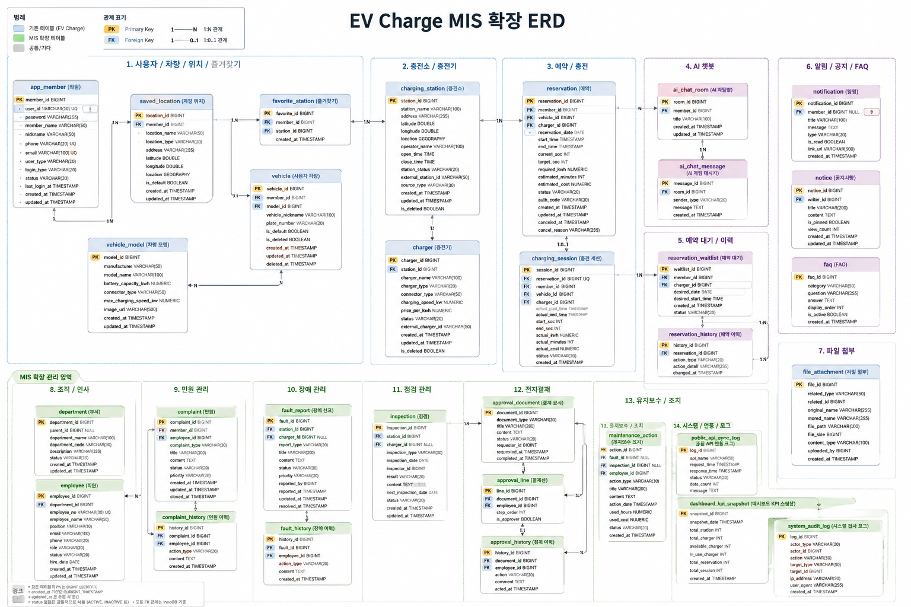
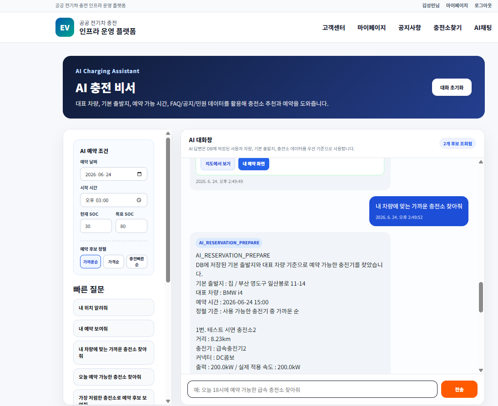
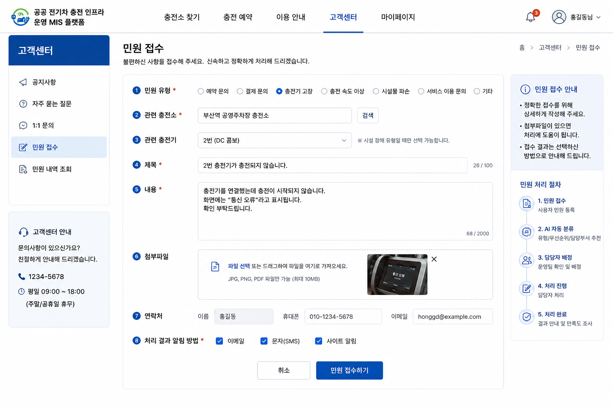
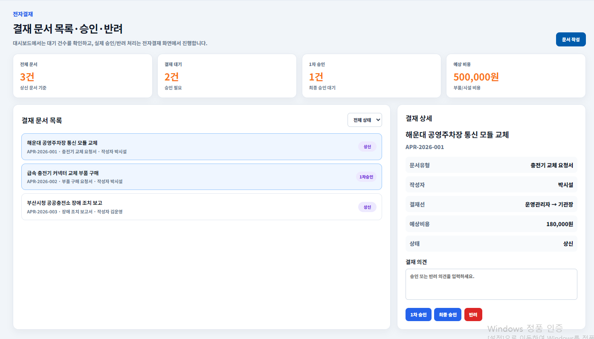

<a id="top"></a>

<p align="center">
  
</p>

# ⚡ 공공 전기차 충전 인프라 운영 MIS 플랫폼

<p align="center">
  <strong>전기차 충전 예약 서비스와 운영기관 업무를 하나로 연결한 통합 관리 플랫폼</strong>
</p>

<p align="center">
  기존 <strong>EV Charge Reservation</strong>을 React 기반 사용자 서비스와<br>
  민원·장애·점검·전자결재를 처리하는 공공기관형 MIS로 확장한 프로젝트입니다.
</p>

<p align="center">
  
  
  
  
  
  
  
  
</p>

---

## 🧭 README 바로가기

| 프로젝트 소개 | 핵심 구현 | 설계·화면 | 시연·문서 |
|---|---|---|---|
| [📌 프로젝트 개요](#overview) | [🚀 주요 구현 기능](#features) | [🏗 시스템 아키텍처](#architecture) | [🎬 기능 시연 영상](#videos) |
| [🔁 프로젝트 확장 배경](#background) | [🔄 핵심 업무 흐름](#workflow) | [🔄 업무 흐름도](#workflow-diagram) | [📁 프로젝트 산출물](#documents) |
| [🎯 프로젝트 개발 목표](#goals) | [🔐 직책별 권한 구조](#roles) | [🗃 ERD](#erd) | [⚙️ 실행 방법](#run) |
| [🛠 기술 스택](#stack) | [⭐ 핵심 기술 구현](#core-tech) | [🖥 주요 화면](#screens) | [🌿 Git·버전 관리](#git) |
| [💻 기술 적용 상세](#tech-detail) | [🧩 주요 DB 테이블](#database) | [📂 프로젝트 구조](#structure) | [👨‍💻 담당 역할](#responsibility) |
| [📝 프로젝트 경험](#retrospective) | [⬆ 맨 위로](#top) |  |  |

> GitHub에서 항목을 클릭하면 해당 위치로 바로 이동합니다.

---

<a id="overview"></a>
## 📌 프로젝트 개요

| 구분 | 내용 |
|---|---|
| **프로젝트명** | 공공 전기차 충전 인프라 운영 MIS 플랫폼 구축 |
| **프로젝트 구분** | 기존 EV Charge Reservation 확장 및 React 기반 리팩토링 |
| **개발 형태** | 개인 프로젝트 · 기존 팀 프로젝트 확장 |
| **진행 배경** | 팀원의 조기 취업으로 이후 기획·설계·개발·통합·테스트·문서화를 1인 수행 |
| **프로젝트 목표** | 사용자 충전 예약 서비스와 운영기관의 민원·장애·점검·결재 업무를 하나의 시스템으로 통합 |
| **Frontend** | React 19, Vite 8, React Router, Axios, Chart.js, SweetAlert2 |
| **Backend** | Java 17, Spring Boot 3.5, Spring Security, MyBatis, Spring Scheduler |
| **Database / Cache** | PostgreSQL 16, PostGIS, Redis |
| **External API / AI** | Gemini API, Kakao Map API, Kakao Mobility API, Kakao 주소검색 API, 환경부 충전소 Open API, Kakao OAuth2 |
| **담당 역할** | 전체 기획, 업무 흐름 설계, DB 설계, 프론트·백엔드 개발, 외부 API 연동, 테스트, Git 관리, 산출물 작성 |

---

<a id="background"></a>
## 🔁 프로젝트 확장 배경

기존 2차 프로젝트는 차량 등록, 충전소 검색, 충전 예약, AI 충전 비서 등 **일반 사용자 중심의 예약 서비스**에 집중했습니다.

3차 프로젝트에서는 기존 기능을 유지하면서 화면을 React SPA 구조로 전환하고, 운영기관 직원이 실제 업무를 처리할 수 있도록 **공공기관형 MIS 기능**을 추가했습니다.

```text
EV Charge Reservation
- JSP 기반 사용자 충전 예약 서비스
- 차량 등록 및 대표 차량 설정
- 충전소 검색과 충전 예약
- AI 충전 비서
- 기본 관리자 통계

                ↓ 확장 및 리팩토링

Public EV Charging Infrastructure MIS
- React + Vite 기반 SPA 전환
- Spring Boot REST API 중심 구조
- 사용자 서비스와 운영기관 MIS 분리
- 직책별 접근 권한 제어
- AI 민원 분류
- 민원 → 장애 → 점검 → 전자결재 → 조치 완료 흐름
- 직원·부서·권한 관리
- 운영 대시보드와 시연용 장애·데이터 생성 기능
```

---

<a id="goals"></a>
## 🎯 프로젝트 개발 목표

### 사용자 서비스와 운영기관 MIS 통합

차량 등록부터 충전소 검색, 예약, 충전 완료까지의 사용자 흐름과 민원·장애·점검·결재로 이어지는 운영기관 업무를 하나의 플랫폼으로 연결했습니다.

### 실제 업무 처리형 MIS 구현

단순 조회·등록 중심의 관리자 화면이 아니라 담당자 배정, 점검 결과 분기, 결재선 승인, 조치 완료 및 이력 저장까지 이어지는 업무 프로세스를 구현했습니다.

### 안정적인 예약 동시성 처리

같은 충전기의 동일 시간대에 여러 사용자가 동시에 예약하는 문제를 줄이기 위해 Redis TTL과 시간 구간 기준의 임시 선점 구조를 적용했습니다.

### 공공데이터와 AI 활용

환경부 충전소 데이터를 자체 DB에 적재하고 Kakao 지도·주소·길찾기 API와 연계했습니다. Gemini API는 충전소 추천과 민원 유형 분류에 활용했습니다.

### 직책별 권한 및 책임 분리

일반회원, 운영담당자, 시설관리담당자, 운영관리자, 기관장의 업무 범위를 분리하고 프론트 UI와 백엔드 API에서 권한을 제어했습니다.

---

<a id="features"></a>
## 🚀 주요 구현 기능

### 👤 회원 및 인증

- 일반 회원가입 및 로그인
- 이메일 인증번호 발송 및 Redis 만료 관리
- BCrypt 기반 비밀번호 암호화
- 카카오 OAuth2 소셜 로그인
- 회원정보 및 비밀번호 변경
- 사용자·직원·관리자 권한별 접근 제어
- 직원 로그인 계정과 인사정보 연계

### 🚗 차량 및 마이페이지

- 차량 모델 기반 차량 등록
- 차량 별칭과 차량번호 관리
- 대표 차량 설정 및 중복 대표 차량 방지
- 예약 현황과 충전 내역 조회
- 예약 상세와 인증코드 확인
- 충전 시작·진행·완료 시뮬레이션
- 실제 충전 완료 시각 및 충전 세션 저장

### 🗺 충전소 검색 및 길찾기

- 환경부 공공데이터 기반 충전소·충전기 데이터 적재
- Kakao Map 기반 충전소 마커 표시
- Kakao 주소검색 API 기반 출발지 등록
- PostGIS 기반 출발지·충전소 거리 계산
- 가까운 충전소 10개 조회
- 충전기 커넥터 타입 필터
- Kakao Mobility API 기반 최단 경로 표시
- 충전소 상세에서 예약 화면 연결

### 📅 충전 예약 및 Redis 선점

- 차량·충전기·예약 날짜·시간 선택
- 현재 SOC와 목표 SOC 기반 필요 충전량 계산
- 충전기 출력과 차량 최대 충전속도를 반영한 예상 시간 계산
- 예상 충전 비용 계산
- 과거 날짜와 시간 예약 차단
- 점검중·고장·운영중지 충전기 예약 차단
- 충전기 + 시작시간 + 예상 종료시간 기준 Redis 임시 선점
- 선점 구간 종료시간에 5분 보호시간 적용
- 10초 keep-alive로 TTL 연장
- 15초 주기 예약 가능 여부 재조회
- 예약 생성 직전 DB 중복·Redis 선점·충전기 상태 최종 검증
- Spring Scheduler 기반 노쇼 및 예약 상태 자동 변경

### 🤖 AI 충전 비서

- Gemini API 기반 대화형 충전 비서
- 사용자별 채팅방과 대화 이력 저장
- Redis 기반 최근 대화 캐시
- 질문 Intent 분석
- 대표 차량과 기본 출발지 조회
- 가까운순·가격순·충전속도순 충전소 추천
- AI 추천 카드에서 지도 보기 및 예약 화면 이동
- 내 예약 현황 조회
- 공지사항·FAQ·예약·민원 DB 조회 결과를 활용한 경량 RAG 응답
- Redis 기반 AI 예약 후보 임시 저장

### 🏢 MIS 대시보드 및 운영관리

- 총 회원·충전소·충전기·예약·매출 KPI 조회
- 충전기 사용가능·예약중·사용중·점검중·고장 현황
- 월별 예약·충전량·매출 통계
- 민원·장애·전자결재 처리 현황
- Chart.js 기반 통계 시각화
- 시연용 공공데이터 샘플 생성
- 충전기 이상 발생 시뮬레이션
- 시뮬레이션 데이터와 대시보드 상태 반영 확인

### 👨‍💼 인사 및 권한 관리

- 직원 등록 시 `app_member`와 `employee` 동시 생성
- 부서·직책·시스템 권한 자동 매핑
- 직원 상태 및 담당 업무 관리
- 관리자 직원 비밀번호 초기화
- 직원 본인 정보와 비밀번호 변경
- 권한 없는 메뉴 잠금 표시 및 클릭 차단
- 백엔드 API 권한 검증

### 📨 민원관리

- 사용자 민원 접수 및 내 민원 조회
- 충전소·충전기 정보 자동 연결
- AI 기반 일반민원·시설장애 의심 분류
- AI 분류 라벨·신뢰도·추천 처리 표시
- 일반 민원 답변 작성 및 완료 처리
- 시설장애 민원의 장애점검관리 이관
- 민원 처리 이력 저장
- 이메일 및 사이트 알림
- 상태·유형·기간·검색어 조건 조회와 페이지네이션

### 🛠 장애·점검·조치 관리

- 민원 또는 시스템 시뮬레이션 기반 장애 접수
- 운영관리자의 시설관리담당자 배정
- 점검 시작과 충전기 점검중 전환
- 점검 진행 게이지 및 결과 등록
- 정상·조치필요·교체필요 결과 분기
- 조치필요 시 수리 진행 후 사용가능 복구
- 교체필요 시 충전기 고장 전환 및 전자결재 연결
- 장애·점검·조치 상태 이력 저장

### ✍ 전자결재

- 시설관리담당자의 교체 요청서 작성 및 상신
- 장애·점검·충전기 정보 자동 입력
- 운영관리자 1차 승인 또는 반려
- 기관장 최종 승인 또는 반려
- 반려 사유 필수 입력
- 전자서명 패드 및 서명 데이터 저장
- 결재선과 처리 이력 조회
- 최종 승인 후 유지보수 작업 자동 연결
- 교체 완료 후 장애·민원·충전기 상태 일괄 처리

---

<a id="workflow"></a>
## 🔄 핵심 업무 흐름

### 사용자 예약 흐름

```text
회원가입 및 로그인
        ↓
차량 등록 및 대표 차량 설정
        ↓
출발지 등록 또는 기본 위치 선택
        ↓
주변 충전소 검색
        ↓
충전소 및 충전기 선택
        ↓
날짜·시간·배터리 잔량 입력
        ↓
예상 충전량·시간·비용 계산
        ↓
Redis 시간 구간 임시 선점
        ↓
DB 중복 예약 및 충전기 상태 최종 검증
        ↓
예약 확정
        ↓
인증코드 확인 및 충전 시뮬레이션
        ↓
충전 완료와 이용 내역 저장
```

### 민원·장애·점검·전자결재 흐름

```text
사용자 기기고장 민원 또는 장애 시뮬레이션
        ↓
AI 민원 유형 분석
        ↓
운영담당자 확인 및 장애접수
        ↓
운영관리자가 시설관리담당자 배정
        ↓
점검 시작
        ↓
점검 결과 등록
        ↓
정상 / 조치필요 / 교체필요
        ↓
교체필요 시 전자결재 상신
        ↓
운영관리자 1차 승인
        ↓
기관장 최종 승인
        ↓
교체·수리 작업 진행
        ↓
장애 완료 및 충전기 사용가능 복구
        ↓
민원·장애·결재·통계 반영
```

---

<a id="roles"></a>
## 🔐 직책별 권한 구조

| 권한 | 역할 | 주요 업무 |
|---|---|---|
| **USER** | 일반회원 | 차량 관리, 충전소 검색, 예약, AI 채팅, 민원 접수·조회 |
| **OPERATOR** | 운영담당자 | 회원·예약 문의 처리, 일반 민원 답변, 시설장애 민원 이관, 공지 관리 |
| **ENGINEER** | 시설관리담당자 | 배정된 장애 점검, 점검 결과 등록, 조치 진행, 전자결재 상신 |
| **MANAGER** | 운영관리자 | 장애 담당자 배정, 운영 현황 관리, 전자결재 1차 승인, 통계 조회 |
| **ADMIN** | 기관장·최고관리자 | 전체 시스템 관리, 직원·권한 관리, 전자결재 최종 승인, 전체 통계 조회 |

---

<a id="stack"></a>
## 🛠 기술 스택 하이라이트

### Frontend

`React 19` `Vite 8` `React Router` `Axios`  
`Chart.js` `SweetAlert2` `Swiper`

### Backend

`Java 17` `Spring Boot 3.5` `Spring Security`  
`MyBatis` `Spring Scheduler` `WebClient` `Validation`

### Database / Cache

`PostgreSQL 16` `PostGIS` `Redis`

### External API / AI

`Gemini API` `Kakao OAuth2` `Kakao Map API`  
`Kakao Mobility API` `Kakao 주소검색 API` `환경부 충전소 Open API`

### Development Tools

`STS` `VS Code` `DBeaver` `Another Redis Desktop Manager`  
`Git` `GitHub` `draw.io`

---

<a id="tech-detail"></a>
## 💻 기술 적용 상세

| 기술 | 적용 내용 |
|---|---|
| **React + Vite** | 기존 JSP 화면을 컴포넌트 기반 SPA로 전환하고 사용자 영역과 MIS 영역을 분리 |
| **React Router** | 사용자·마이페이지·고객센터·관리자 화면의 중첩 라우팅 구성 |
| **Axios** | 공통 API 모듈을 통해 Spring Boot REST API 요청 처리 |
| **Chart.js** | 예약, 충전량, 매출, 민원, 장애 현황을 차트로 시각화 |
| **Spring Boot** | 사용자 서비스와 운영기관 MIS의 REST API 및 비즈니스 로직 구현 |
| **Spring Security** | 로그인, 카카오 OAuth2, 비밀번호 암호화 및 역할별 접근 제어 |
| **MyBatis** | 검색·통계·업무 이력 등 조건이 복잡한 SQL을 Mapper XML로 관리 |
| **PostgreSQL** | 회원, 차량, 충전소, 예약, 민원, 장애, 점검, 결재 이력 영구 저장 |
| **PostGIS** | 출발지와 충전소 위치 저장, 거리 계산, 가까운 충전소 정렬 |
| **Redis** | 이메일 인증번호, AI 대화 캐시, AI 예약 후보, 충전기 시간 구간 선점 관리 |
| **Spring Scheduler** | 예약 인증시간 초과 노쇼 처리와 예약·충전 상태 자동 변경 |
| **Gemini API** | 충전소 추천, 사용자 질문 의도 분석, 민원 유형 분류 및 답변 생성 |
| **Kakao API** | 소셜 로그인, 지도 표시, 주소 좌표 변환, 길찾기 경로 조회 |
| **환경부 Open API** | 실제 공공 충전소·충전기 데이터를 자체 DB에 적재하여 서비스에 활용 |

---

<a id="core-tech"></a>
## ⭐ 핵심 기술 구현

### Redis 시간 구간 예약 선점

```text
충전기 ID
+ 예약 시작시간
+ 예상 종료시간
+ 종료 후 5분 보호시간
= 임시 선점 구간
```

- `SET NX` 방식으로 동시 선점 충돌 방지
- 사용자 입력 변경 시 기존 선점 해제 후 새 구간 재선점
- 10초 keep-alive로 TTL 갱신
- 예약 완료 또는 페이지 이탈 시 선점 해제
- DB 확정 예약과 Redis 임시 선점을 함께 검사

### PostGIS 기반 주변 충전소 검색

```text
환경부 충전소 주소
→ Kakao 주소검색 API로 좌표 변환
→ PostgreSQL/PostGIS 위치 데이터 저장
→ 사용자 출발지와 충전소 거리 계산
→ 가까운 충전소 순서로 조회
```

### DB 기반 경량 RAG AI 응답

```text
사용자 질문
→ Intent 분석
→ 회원·차량·출발지·충전소·예약·공지·FAQ 조회
→ 조회 결과를 Gemini 프롬프트에 포함
→ 프로젝트 데이터에 맞는 답변과 액션 카드 생성
```

### 트랜잭션 기반 MIS 업무 처리

다음과 같이 여러 테이블의 상태가 함께 변경되는 업무를 트랜잭션으로 처리했습니다.

```text
직원 등록
→ app_member 생성
→ employee 생성

점검 결과 등록
→ inspection 저장
→ fault_report 상태 변경
→ charger 상태 변경
→ complaint 상태 변경

전자결재 상신
→ approval_document 저장
→ approval_line 생성
→ approval_history 저장
→ fault_history 저장

최종 승인 및 교체 완료
→ 결재 상태 변경
→ maintenance_action 생성·완료
→ 장애 완료
→ 충전기 사용가능 복구
```

---

<a id="architecture"></a>
## 🏗 시스템 아키텍처

React 사용자 서비스와 관리자 MIS가 Spring Boot API를 호출하고, PostgreSQL·PostGIS·Redis 및 외부 API와 연동되는 전체 시스템 구조입니다.

<p align="center">
  <a href="docs/images/시스템아키텍처.png">
    
  </a>
</p>

<p align="center">
  <sub>이미지를 클릭하면 원본 크기로 확인할 수 있습니다.</sub>
</p>

---

<a id="workflow-diagram"></a>
## 🔄 업무 흐름도

사용자 서비스와 운영기관 MIS에서 민원, 장애, 점검, 결재, 조치 완료로 이어지는 업무 흐름입니다.

<p align="center">
  <a href="docs/images/업무흐름도.png">
    
  </a>
</p>

<p align="center">
  <sub>이미지를 클릭하면 원본 크기로 확인할 수 있습니다.</sub>
</p>

---

<a id="erd"></a>
## 🗃 ERD

기존 전기차 충전 예약 도메인과 MIS 확장 도메인의 테이블 관계를 통합한 ERD입니다.

<p align="center">
  <a href="docs/images/erd.png">
    
  </a>
</p>

<p align="center">
  <sub>이미지를 클릭하면 원본 크기로 확인할 수 있습니다.</sub>
</p>

---

<a id="screens"></a>
## 🖥 주요 화면

<table>
  <tr>
    <td width="33.3%" align="center">
      <a href="docs/images/screenshots/ai예약.png">
        
      </a>
      <br>
      <strong>AI 충전 예약</strong>
      <br>
      <sub>차량·위치·예약 가능 시간 기반 충전소 추천</sub>
    </td>
    <td width="33.3%" align="center">
      <a href="docs/images/screenshots/민원접수화면.png">
        
      </a>
      <br>
      <strong>민원 접수</strong>
      <br>
      <sub>충전소·충전기 연계 및 AI 자동 분류</sub>
    </td>
    <td width="33.3%" align="center">
      <a href="docs/images/screenshots/전자결재서비스.png">
        
      </a>
      <br>
      <strong>전자결재 서비스</strong>
      <br>
      <sub>상신·1차 승인·최종 승인·전자서명 처리</sub>
    </td>
  </tr>
</table>

---

<details open>
<a id="videos"></a>
<summary><strong>🎬 기능 시연 영상</strong></summary>

<br>

### 사용자 및 인증 기능

<table>
  <tr>
    <td width="50%" align="center">
      <a href="https://youtu.be/3iQabIfbiZM">
        
      </a>
      <br>
      <strong>회원가입</strong>
      <br>
      <sub>이메일 인증과 회원 계정 생성 흐름</sub>
    </td>
    <td width="50%" align="center">
      <a href="https://youtu.be/Lcql9z_Qvok">
        
      </a>
      <br>
      <strong>카카오 소셜 로그인</strong>
      <br>
      <sub>OAuth2 기반 카카오 로그인 흐름</sub>
    </td>
  </tr>
  <tr>
    <td width="50%" align="center">
      <a href="https://youtu.be/TjK7qc_KRwQ">
        
      </a>
      <br>
      <strong>회원정보 변경</strong>
      <br>
      <sub>회원정보와 비밀번호 수정 처리</sub>
    </td>
    <td width="50%" align="center">
      <a href="https://youtu.be/7H4gundoctA">
        
      </a>
      <br>
      <strong>차량 등록</strong>
      <br>
      <sub>차량 모델 선택과 대표 차량 설정</sub>
    </td>
  </tr>
</table>

### 예약 및 AI 기능

<table>
  <tr>
    <td width="50%" align="center">
      <a href="https://youtu.be/kHSc1uPNx3s">
        
      </a>
      <br>
      <strong>Redis 예약 선점</strong>
      <br>
      <sub>동일 충전기·시간대의 중복 예약 방지</sub>
    </td>
    <td width="50%" align="center">
      <a href="https://youtu.be/zo3zvUK4eLQ">
        
      </a>
      <br>
      <strong>AI 충전 예약</strong>
      <br>
      <sub>사용자 조건 기반 충전소 추천과 예약 연결</sub>
    </td>
  </tr>
</table>

### 운영기관 MIS 기능

<table>
  <tr>
    <td width="50%" align="center">
      <a href="https://youtu.be/Moz3arw0_2U">
        
      </a>
      <br>
      <strong>직원 등록·로그인·권한</strong>
      <br>
      <sub>부서·직책별 계정 생성과 메뉴 접근 제어</sub>
    </td>
    <td width="50%" align="center">
      <a href="https://youtu.be/79qVDq0sK8Q">
        
      </a>
      <br>
      <strong>시연 데이터 생성과 반영</strong>
      <br>
      <sub>운영 데이터 생성 후 대시보드 상태 반영 확인</sub>
    </td>
  </tr>
  <tr>
    <td width="50%" align="center">
      <a href="https://youtu.be/4wZbhkTNW9k">
        
      </a>
      <br>
      <strong>충전기 이상 시뮬레이션</strong>
      <br>
      <sub>장애 발생과 충전기 상태 변경 흐름</sub>
    </td>
    <td width="50%" align="center">
      <a href="https://youtu.be/jqeugy5jZ6s">
        
      </a>
      <br>
      <strong>민원 처리·장애 점검·전자결재</strong>
      <br>
      <sub>민원 접수부터 최종 승인과 조치 완료까지의 전체 흐름</sub>
    </td>
  </tr>
</table>

</details>

---

<details open>
<a id="documents"></a>
<summary><strong>📁 프로젝트 산출물</strong></summary>

<br>

| 산출물 | 설명 | 바로가기 |
|---|---|---|
| **프로젝트 발표자료** | 프로젝트 배경, 주요 기능, 기술 구현 및 시연 결과 | [PDF 보기](docs/산출물/프로젝트발표자료.pdf) |
| **화면설계서** | 사용자 서비스와 관리자 MIS 화면 구성 및 기능 설명 | [ODP 보기](docs/산출물/화면설계서.odp) |
| **프로그램 기술서** | 화면별 프로그램 구성, 이벤트 처리 및 데이터 연동 내용 | [DOCX 보기](docs/산출물/프로그램기술서.docx) |
| **메뉴구조도** | 사용자·관리자 메뉴와 기능별 파일 구성 | [XLSX 보기](docs/산출물/메뉴구조도.xlsx) |
| **테이블 명세서** | 테이블, 컬럼, 데이터 타입, 키 및 제약조건 정의 | [XLSX 보기](docs/산출물/테이블명세서.xlsx) |
| **Redis Key 설계서** | 이메일 인증, 예약 선점, AI 캐시 등 Redis Key와 TTL 정의 | [XLSX 보기](docs/산출물/Redis_Key_설계서.xlsx) |
| **업무 흐름도** | 민원·장애·점검·전자결재 전체 업무 흐름 | [PNG 보기](docs/images/업무흐름도.png) |
| **시스템 아키텍처** | React·Spring Boot·DB·Redis·외부 API 연결 구조 | [PNG 보기](docs/images/시스템아키텍처.png) |
| **통합 ERD** | 사용자 서비스와 MIS 확장 테이블 관계 | [PNG 보기](docs/images/erd.png) |

</details>

<p align="right"><a href="#top">⬆ 맨 위로</a></p>

---

<a id="structure"></a>
## 📂 프로젝트 구조

```text
ev-charge-reservation/
├─ backend/                         # Spring Boot + MyBatis API 서버
│  ├─ src/main/java/com/ev/
│  │  ├─ config/                    # Security, Redis, Web 설정
│  │  ├─ controller/
│  │  │  ├─ admin/                  # 운영기관 MIS API
│  │  │  └─ user/                   # 사용자 서비스 API
│  │  ├─ dao/                       # MyBatis DAO
│  │  ├─ dto/                       # 도메인별 DTO
│  │  ├─ exception/                 # 공통 예외 처리
│  │  ├─ scheduler/                 # 예약·노쇼 상태 자동 처리
│  │  ├─ security/                  # 로그인·OAuth2·권한 처리
│  │  └─ service/                   # 사용자·관리자 비즈니스 로직
│  │
│  └─ src/main/resources/
│     ├─ mybatis/mappers/
│     │  ├─ admin/
│     │  └─ user/
│     ├─ application.properties
│     └─ application-secret.properties
│
├─ frontend/                        # React + Vite SPA
│  └─ src/
│     ├─ apis/                      # Axios API 모듈
│     ├─ components/                # 공통·사용자·관리자 컴포넌트
│     ├─ contexts/                  # 인증 및 전역 상태
│     ├─ layouts/                   # Public·MyPage·Customer·Admin 레이아웃
│     ├─ pages/
│     │  ├─ public/                 # 사용자 서비스 화면
│     │  └─ admin/                  # 운영기관 MIS 화면
│     ├─ routes/                    # React Router 설정
│     ├─ styles/                    # 화면별 CSS
│     ├─ App.jsx
│     └─ main.jsx
│
├─ database/                        # PostgreSQL·PostGIS 스키마와 초기 데이터
├─ redis/                           # Redis 설정 및 Key 설계 문서
├─ docs/
│  ├─ images/
│  │  ├─ main-banner.png
│  │  ├─ erd.png
│  │  ├─ 시스템아키텍처.png
│  │  ├─ 업무흐름도.png
│  │  └─ screenshots/
│  │     ├─ ai예약.png
│  │     ├─ 민원접수화면.png
│  │     └─ 전자결재서비스.png
│  │
│  └─ 산출물/
│     ├─ Redis_Key_설계서.xlsx
│     ├─ 메뉴구조도.xlsx
│     ├─ 테이블명세서.xlsx
│     ├─ 프로그램기술서.docx
│     ├─ 프로젝트발표자료.pdf
│     └─ 화면설계서.odp
│
├─ .gitignore
└─ README.md
```

---

<a id="database"></a>
## 🧩 주요 데이터베이스 테이블

### 사용자 서비스

```text
app_member
vehicle_model
vehicle
saved_location
charging_station
charger
reservation
reservation_history
charging_session
favorite_station
ai_chat_room
ai_chat_message
```

### 운영기관 MIS

```text
department
employee
notice
faq
complaint
complaint_history
ai_classification
fault_report
fault_history
inspection
approval_document
approval_line
approval_history
maintenance_action
notification
file_attachment
public_api_sync_log
dashboard_kpi_snapshot
system_audit_log
```

---

<a id="run"></a>
## ⚙️ 실행 방법

### Backend

```bash
cd backend
./gradlew bootRun
```

Windows 환경:

```cmd
cd backend
gradlew.bat bootRun
```

### Frontend

```bash
cd frontend
npm install
npm run dev
```

기본 개발 서버:

```text
Frontend: http://localhost:5173
Backend : http://localhost:8383
```

### 환경 설정 주의사항

다음 파일에는 DB 비밀번호와 외부 API Key가 포함될 수 있으므로 Git에 커밋하지 않습니다.

```text
frontend/.env
backend/src/main/resources/application-secret.properties
```

필요한 주요 설정값:

```properties
spring.datasource.url=jdbc:postgresql://localhost:5432/ev_charge_mis
spring.datasource.username=DB_USERNAME
spring.datasource.password=DB_PASSWORD

spring.data.redis.host=localhost
spring.data.redis.port=6379

gemini.api.key=GEMINI_API_KEY
kakao.rest-api.key=KAKAO_REST_API_KEY
```

---

<a id="git"></a>
## 🌿 Git 브랜치 및 버전 관리

```text
v1.0
└─ 2차 프로젝트 EV Charge Reservation 기본 완성본

v1.1
└─ 2차 프로젝트 README·산출물·시연 영상 정리본

main
└─ React 기반 사용자 서비스와 운영기관 MIS로 확장한 3차 프로젝트

v2.0
└─ 3차 프로젝트 최종 코드와 README·산출물 정리 버전
```

개발 과정에서는 기능별 브랜치와 Pull Request를 사용하여 변경 내용을 관리했습니다.

```text
feature branch
      ↓
개발 및 기능 테스트
      ↓
Commit / Push
      ↓
Pull Request
      ↓
develop 통합
      ↓
main 반영
      ↓
Release 생성
```

---

<a id="responsibility"></a>
## 👨‍💻 담당 역할

- 프로젝트 주제 선정 및 기존 서비스 확장 방향 기획
- 사용자 서비스와 운영기관 MIS 메뉴·권한 구조 설계
- 민원·장애·점검·전자결재 업무 흐름 설계
- 통합 ERD와 PostgreSQL·PostGIS 스키마 설계
- React 사용자 화면 및 관리자 MIS 화면 구현
- Spring Boot REST API와 MyBatis Mapper 구현
- Redis 시간 구간 예약 선점 및 TTL 관리
- Gemini AI 충전 추천과 민원 자동 분류 구현
- Kakao 지도·주소검색·길찾기 API 연동
- 환경부 공공데이터 수집 및 DB 적재
- 직원·부서·권한 관리와 전자결재 기능 구현
- Git 브랜치·커밋·PR·Release 관리
- 화면설계서, 프로그램기술서, 메뉴구조도, 테이블명세서, 발표자료 작성

---

<a id="retrospective"></a>
## 📝 프로젝트 경험

기존 전기차 충전 예약 서비스를 단순히 화면만 변경하는 수준이 아니라, 사용자 서비스와 운영기관의 실제 업무가 연결되는 MIS로 확장했습니다.

특히 민원 접수 이후 장애 등록, 담당자 배정, 점검 결과 분기, 전자결재, 수리 완료까지 여러 테이블과 권한이 함께 움직이는 흐름을 구현하면서 초기 업무 프로세스와 데이터 구조 설계가 전체 개발에 큰 영향을 준다는 점을 배웠습니다.

또한 Redis 예약 선점, PostGIS 위치 검색, 공공데이터와 Kakao API 연동, Gemini 기반 AI 추천·분류 기능을 적용하며 기능 구현뿐 아니라 동시성, 데이터 일관성, 권한 분리, 예외 처리와 사용자 경험을 함께 고려했습니다.

팀원의 조기 취업으로 프로젝트 후반을 1인 프로젝트로 진행했지만, 기획부터 개발, 테스트, Git 관리, 산출물 정리까지 끝까지 완성하며 전체 시스템을 스스로 통합하고 문제를 해결하는 경험을 쌓았습니다.

<p align="right"><a href="#top">⬆ 맨 위로</a></p>

---

<p align="center">
  <strong>EV Charge Reservation에서 공공 전기차 충전 인프라 운영 MIS까지</strong><br>
  사용자 편의와 운영기관의 업무 효율을 함께 고려한 통합 플랫폼을 구현했습니다.
</p>
