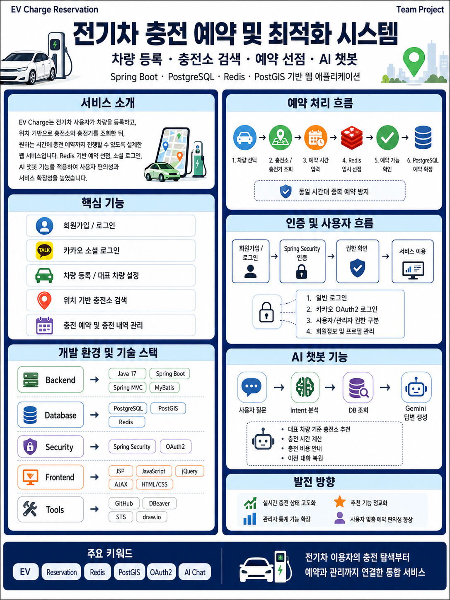

# ⚡ EV Charge Reservation

<p align="center">
  <strong>전기차 충전 예약 및 최적화 웹 애플리케이션</strong>
</p>

<p align="center">
  차량 등록부터 충전소 검색, 충전기 선택, 예약 선점 및 충전 관리까지<br>
  전기차 이용자의 충전 과정을 하나의 서비스로 연결한 웹 프로젝트입니다.
</p>

<p align="center">
  
  
  
  
  
  
</p>

<!--
메인 배너 제작 후 아래 주석을 해제합니다.

<p align="center">
  
</p>
-->

---

## 📌 프로젝트 개요

| 구분 | 내용 |
|---|---|
| **프로젝트명** | EV Charge Reservation |
| **프로젝트 형태** | 전기차 충전 예약 및 최적화 웹 애플리케이션 |
| **개발 방식** | 팀 프로젝트 |
| **주요 역할** | 프로젝트 기획, 구조 설계, 기능 개발, 소스 통합 및 문서화 |
| **백엔드** | Java 17, Spring Boot 3.5, Spring MVC, MyBatis |
| **데이터베이스** | PostgreSQL 16, PostGIS 3.6 |
| **인증 및 실시간 처리** | Spring Security, OAuth2, Redis, WebSocket |
| **프론트엔드** | JSP, JavaScript, jQuery, AJAX, HTML, CSS |

---

## 📍 프로젝트 개발 목표

### 전기차 충전 서비스의 전체 흐름 구현

사용자가 차량을 등록하고 주변 충전소와 충전기를 조회한 뒤, 원하는 시간에 충전 예약을 진행할 수 있도록 서비스 흐름을 구성했습니다.

### 중복 예약 방지 및 예약 안정성 확보

동일 충전기의 동일 시간대에 여러 사용자가 동시에 예약하는 문제를 줄이기 위해 Redis를 활용한 임시 예약 선점 구조를 적용했습니다.

### 위치 기반 충전소 검색

PostgreSQL과 PostGIS를 활용하여 사용자의 저장 위치와 충전소 간 거리를 계산하고, 차량 커넥터와 호환되는 충전소를 조회할 수 있도록 설계했습니다.

### 안전한 사용자 인증 및 권한 관리

Spring Security와 OAuth2를 활용하여 일반 로그인과 카카오 소셜 로그인을 처리하고, 사용자와 관리자 권한에 따라 접근 가능한 기능을 구분했습니다.

### 유지보수 가능한 계층형 구조 적용

Controller, Service, DAO, Mapper를 역할별로 분리하고 공통 네이밍 규칙과 패키지 구조를 적용하여 기능 확장과 유지보수가 쉽도록 구성했습니다.

---

## 🚀 주요 구현 기능

### 회원 및 인증

- 일반 회원가입 및 로그인
- BCrypt 기반 비밀번호 암호화
- Spring Security 인증·인가
- 카카오 OAuth2 소셜 로그인
- 이메일 인증번호 발송 및 확인
- 사용자·관리자 권한별 접근 제어
- 회원정보 및 프로필 이미지 수정

### 차량 관리

- 차량 모델 마스터 기반 차량 등록
- 차량 별칭 및 차량번호 관리
- 대표 차량 설정
- 사용자별 등록 차량 조회
- AJAX 기반 대표 차량 변경
- 차량 논리 삭제 및 이력 보존

### 충전소 및 충전기

- 충전소와 충전기 정보 조회
- PostGIS 기반 위치 및 거리 계산
- 사용자 기본 위치 기준 주변 충전소 검색
- 대표 차량 커넥터 타입 기반 충전기 조회
- 충전기 상태 및 요금 정보 제공
- 충전소 즐겨찾기 구조 설계

### 충전 예약

- 차량 및 충전기 선택
- 현재 배터리와 목표 배터리 입력
- 필요 충전량 계산
- 예상 충전 시간 및 비용 계산
- Redis 기반 예약 임시 선점
- 동일 시간대 중복 예약 방지
- 예약 상태 및 충전 내역 관리

### AI 챗봇

- Gemini API 기반 AI 챗봇
- 사용자별 채팅방 및 메시지 저장
- 이전 대화 복원
- Intent 기반 사용자 질문 분석
- 대표 차량 기준 충전소 추천
- 충전 시간 및 예상 비용 계산
- 실제 DB 조회 결과 기반 답변 생성

### 관리자 기능

- 관리자 대시보드
- 회원 목록 및 상세 조회
- 회원 상태 변경 및 복구
- 등록 차량·예약·충전 내역 조회
- 충전소 및 충전기 운영 현황 조회
- 예약과 매출 통계 확인

---

## 🔄 서비스 이용 흐름

```text
회원가입 및 로그인
        ↓
차량 등록 및 대표 차량 설정
        ↓
기본 위치 또는 현재 위치 설정
        ↓
주변 충전소 검색
        ↓
차량과 호환되는 충전기 선택
        ↓
예약 시간 및 목표 충전량 입력
        ↓
Redis 기반 예약 임시 선점
        ↓
예약 가능 여부 확인
        ↓
PostgreSQL 예약 확정
        ↓
충전 진행 및 충전 내역 저장
```

---

## 🛠 기술 스택 하이라이트

### Backend

`Java 17` `Spring Boot 3.5` `Spring MVC` `MyBatis`  
`Spring Security` `OAuth2 Client` `WebSocket`

### Frontend

`JSP` `JavaScript` `jQuery` `AJAX` `HTML5` `CSS3`

### Database / Cache

`PostgreSQL 16` `PostGIS 3.6` `Redis 5`

### External API

`Kakao OAuth2` `Gemini API`

### Development Tools

`STS 4.31` `DBeaver Community`  
`Another Redis Desktop Manager` `Git` `GitHub` `draw.io`

---

## 💻 기술 스택 상세

### 프론트엔드

| 기술 | 적용 내용 |
|---|---|
| **JSP** | Spring MVC 기반 서버 사이드 화면 구성 |
| **JavaScript** | 화면 이벤트 및 사용자 입력 처리 |
| **jQuery** | DOM 제어와 이벤트 처리 |
| **AJAX** | 페이지 새로고침 없는 비동기 요청 처리 |
| **HTML / CSS** | 사용자·관리자 화면 및 반응형 UI 구성 |

### 백엔드

| 기술 | 적용 내용 |
|---|---|
| **Java 17** | 프로젝트 주요 비즈니스 로직 구현 |
| **Spring Boot 3.5** | 애플리케이션 설정 및 내장 서버 환경 구성 |
| **Spring MVC** | Controller 중심의 요청·응답 처리 |
| **MyBatis** | SQL Mapper 기반 데이터 조회 및 처리 |
| **Spring Security** | 로그인, 권한 검증 및 URL 접근 제어 |
| **OAuth2** | 카카오 소셜 로그인 연동 |
| **WebSocket** | 실시간 채팅 및 알림 기능 확장 구조 |

### 데이터베이스 및 캐시

| 기술 | 적용 내용 |
|---|---|
| **PostgreSQL 16** | 회원, 차량, 충전소, 예약, 충전 이력 영구 저장 |
| **PostGIS 3.6** | 위치 정보 저장, 거리 계산 및 주변 충전소 검색 |
| **Redis 5** | 예약 임시 선점, 인증번호, 캐시 및 실시간 데이터 처리 |

---

## 🗃 데이터 저장 기준

| 데이터 성격 | 저장 위치 |
|---|---|
| 회원, 차량, 충전소, 충전기 | PostgreSQL |
| 확정된 충전 예약 | PostgreSQL |
| 실제 충전 내역 및 통계 | PostgreSQL |
| 위치 좌표 및 거리 계산 | PostgreSQL + PostGIS |
| 예약 확정 전 임시 선점 | Redis |
| 이메일 인증번호 | Redis |
| 빠르게 변경되는 상태와 캐시 | Redis |

```text
PostgreSQL
= 반드시 보존해야 하는 서비스 원본 데이터

Redis
= 임시 데이터, 실시간 상태, 예약 선점 및 캐시
```

---

## 📂 프로젝트 구조

```text
ev-charge-reservation/
├─ backend/                         # Spring Boot + JSP + MyBatis 소스
├─ database/                        # PostgreSQL DB 스크립트
├─ docs/                            # 프로젝트 문서 및 산출물
│  ├─ images/
│  │  ├─ ev_charging_system_architecture.drawio
│  │  ├─ ev-charge-erd.drawio
│  │  └─ 개선 업무흐름도 .drawio
│  │
│  ├─ ppt/
│  │  └─ 최종보고서 2팀.pdf
│  │
│  ├─ EV_Charge_메뉴구조도.xlsx
│  ├─ 프로젝트기술서.pdf
│  └─ 화면설계서.odp
│
├─ frontend/                        # 화면 설계 및 UI 프로토타입
├─ .gitignore
└─ README.md
```

---

## 🧩 백엔드 패키지 구조

```text
com.ev
├─ config                           # Security, Web, Redis 등 환경 설정
├─ controller
│  ├─ admin                         # 관리자 요청 처리
│  └─ user                          # 사용자 요청 처리
├─ dao
│  ├─ admin                         # 관리자 데이터 접근
│  └─ user                          # 사용자 데이터 접근
├─ dto                              # 도메인별 데이터 전달 객체
├─ exception                        # 공통 예외 처리
├─ security                         # 인증 사용자와 로그인 처리
└─ service
   ├─ admin                         # 관리자 비즈니스 로직
   └─ user                          # 사용자 비즈니스 로직
```

---

## 📁 Resource 구조

```text
src/main/resources
├─ mybatis
│  └─ mappers
│     ├─ admin
│     └─ user
├─ static
│  ├─ css
│  ├─ images
│  └─ js
├─ application.properties
└─ application-secret.properties
```

```text
src/main/webapp/WEB-INF/views
├─ admin
├─ common
└─ user
```

---

## ⚙️ MyBatis Mapper 설정

```properties
mybatis.mapper-locations=classpath:/mybatis/mappers/**/*.xml
mybatis.type-aliases-package=com.ev.dto
```

DAO 인터페이스와 Mapper XML의 namespace를 일치시키고, 기능별 Mapper를 자동으로 탐색하도록 구성했습니다.

---

<details>
<summary><strong>📁 프로젝트 설계 산출물</strong></summary>

<br>

### 📌 업무 흐름도

사용자의 회원가입부터 차량 등록, 충전소 검색, 예약 및 충전 완료까지의 업무 흐름을 정리한 문서입니다.

- [업무 흐름도 원본 열기](<docs/images/개선 업무흐름도 .drawio>)

> `.drawio` 파일은 GitHub에서 바로 미리보기되지 않을 수 있으며, 파일을 내려받아 draw.io에서 열 수 있습니다.

---

### 📌 시스템 아키텍처도

Spring Boot, PostgreSQL, PostGIS, Redis, 외부 API 및 사용자 화면 간 연결 구조를 정리한 문서입니다.

- [시스템 아키텍처도 원본 열기](docs/images/ev_charging_system_architecture.drawio)

---

### 📌 ERD

회원, 차량, 차량 모델, 충전소, 충전기, 예약, 충전 세션 및 AI 채팅 테이블의 관계를 정리한 문서입니다.

- [ERD 원본 열기](docs/images/ev-charge-erd.drawio)

</details>

---

<details>
<summary><strong>🎤 최종 발표 자료</strong></summary>

<br>

프로젝트 기획 배경, 시스템 구성, 주요 구현 기능, DB 설계 및 개발 결과를 정리한 최종 발표 자료입니다.

- [최종 발표 자료 보기](<docs/ppt/최종보고서 2팀.pdf>)

PDF 파일은 GitHub에서 바로 열거나 내려받을 수 있습니다.

</details>

---

<details>
<summary><strong>📘 프로젝트 기술서</strong></summary>

<br>

프로젝트 개요, 사용 기술, 주요 기능, 구현 과정 및 프로젝트 결과를 정리한 기술 문서입니다.

- [프로젝트 기술서 보기](docs/프로젝트기술서.pdf)

</details>

---

<details>
<summary><strong>🖥 화면설계서</strong></summary>

<br>

사용자 화면과 관리자 화면의 구성, 입력 항목 및 화면 이동 흐름을 정리한 문서입니다.

- [화면설계서 내려받기](docs/화면설계서.odp)

> `.odp` 파일은 LibreOffice Impress 또는 Microsoft PowerPoint에서 열 수 있습니다.

</details>

---

<details>
<summary><strong>🗂 메뉴구조도</strong></summary>

<br>

사용자와 관리자 메뉴를 기능별로 구분하고 각 화면의 연결 관계를 정리한 문서입니다.

- [메뉴구조도 내려받기](docs/EV_Charge_메뉴구조도.xlsx)

> `.xlsx` 파일은 Microsoft Excel 또는 호환 프로그램에서 열 수 있습니다.

</details>

---

<details>
<summary><strong>🗄 데이터베이스 스크립트</strong></summary>

<br>

회원, 차량, 충전소, 충전기, 예약, 충전 세션, 즐겨찾기 및 AI 채팅 테이블 생성문을 포함합니다.

- [EV-CHARGE.SQL 보기](database/EV-CHARGE.SQL)

### 주요 테이블

```text
app_member
saved_location
vehicle_model
vehicle
charging_station
charger
reservation
charging_session
favorite_station
ai_chat_room
ai_chat_message
```

</details>

---

<details>
<summary><strong>🌿 브랜치 전략 및 Git 규칙</strong></summary>

<br>

### 브랜치 구성

```text
main
develop
feature/member
feature/vehicle
feature/reservation
feature/station
feature/ai-chat
feature/admin-dashboard
```

### 작업 흐름

```text
기능별 브랜치 생성
        ↓
기능 구현 및 테스트
        ↓
Commit 및 Push
        ↓
Pull Request 작성
        ↓
코드 확인 및 충돌 해결
        ↓
develop 병합
        ↓
최종 검증 후 main 병합
```

### 커밋 메시지 예시

```bash
feat: implement reservation feature
fix: resolve duplicate reservation issue
refactor: improve vehicle service structure
docs: update README
chore: configure redis connection
```

</details>

---

<details>
<summary><strong>📦 릴리즈 내역</strong></summary>

<br>

| 버전 | 주요 내용 |
|---|---|
| **v1.0** | EV Charge Reservation 프로젝트 기본 완성 버전 |
| **v1.1** | 소스 코드는 v1.0을 유지하고 README 및 프로젝트 산출물을 정리한 문서 개선 버전 |

### v1.1 변경 사항

- README 프로젝트 소개 개선
- 주요 기술 스택과 적용 목적 정리
- 핵심 구현 기능 설명 보완
- 프로젝트 구조 및 백엔드 패키지 구조 정리
- 업무 흐름도, 시스템 아키텍처도 및 ERD 연결
- 프로젝트 기술서 및 최종 발표 자료 연결
- 화면설계서와 메뉴구조도 연결
- 데이터베이스 SQL 문서 연결

</details>

---

## 📎 프로젝트 산출물 요약

| 산출물 | 파일 |
|---|---|
| 업무 흐름도 | [개선 업무흐름도.drawio](<docs/images/개선 업무흐름도 .drawio>) |
| 시스템 아키텍처도 | [ev_charging_system_architecture.drawio](docs/images/ev_charging_system_architecture.drawio) |
| ERD | [ev-charge-erd.drawio](docs/images/ev-charge-erd.drawio) |
| 최종 발표 자료 | [최종보고서 2팀.pdf](<docs/ppt/최종보고서 2팀.pdf>) |
| 프로젝트 기술서 | [프로젝트기술서.pdf](docs/프로젝트기술서.pdf) |
| 화면설계서 | [화면설계서.odp](docs/화면설계서.odp) |
| 메뉴구조도 | [EV_Charge_메뉴구조도.xlsx](docs/EV_Charge_메뉴구조도.xlsx) |
| DB 스크립트 | [EV-CHARGE.SQL](database/EV-CHARGE.SQL) |

---

## 💡 프로젝트를 통해 경험한 내용

- Spring Boot 기반 계층형 웹 애플리케이션 설계
- Spring Security 및 OAuth2 인증 구조 적용
- PostgreSQL과 PostGIS를 활용한 위치 기반 데이터 처리
- Redis 기반 예약 선점 및 임시 데이터 관리
- MyBatis Mapper를 통한 SQL 중심 데이터 처리
- 사용자와 관리자 기능 분리
- AJAX 기반 화면 상태 즉시 반영
- AI API와 내부 DB를 연결한 사용자 맞춤형 답변 처리
- Git 브랜치와 Pull Request 기반 팀 협업
- 프로젝트 산출물 작성 및 GitHub 문서화

---

<p align="center">
  <strong>EV Charge Reservation</strong><br>
  전기차 이용자의 충전 탐색부터 예약과 충전 관리까지 연결한 통합 서비스
</p>